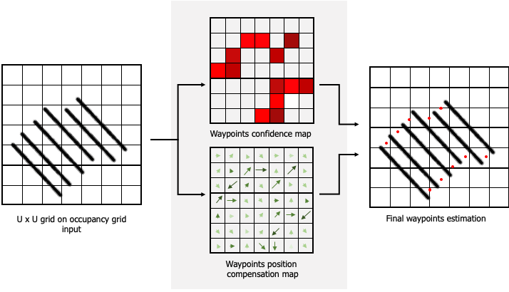

<h1 align="center">  DeepWay </h1>



## Clone the repository and prepare the python environment

First, clone the repository:

``` git clone  https://github.com/fsalv/DeepWay.git ```


Then install the required python packages:
``` 
cd DeepWay
pip install -r requirements.txt
```
We recommend to do it in a separate virtual environment with respect to your main one to avoid compatibility issues for packages versions. In this case, remember to create a jupyter linked to the new environment.

**Warning** If you don't have gpu available or if yuo have CUDA issues, please install the ```tensorflow-cpu``` package.

## Network training

Run the jupyter notebook ```Artificial Dataset Generator.ipynb``` to generate the random synthethic dataset. You can modify useful parameters in the first cells of the notebook.

You can re-train DeepWay on the new generated dataset with the notebook ```DeepWay Train.ipynb```. You can modify network parameters inside the configuration file  ```utils/config.json```. In particular, by modifying the ```DATA_N``` and ```DATA_N_VAL``` values you can choose to train/validate wiwth fewer images to see how prediction quality changes with dataset dimension. You can also modify the network architecture changing ```K```, ```MASK_DIM```, the number of ```FILTERS``` per layer or the ```KERNEL_SIZE```.

You can test DeepWay on both the satellite and synthethic test datasets with the notebook ```DeepWay Test.ipynb```. This notebooks allows you to compute the AP metric on the selected images. You can change the test set inside the notebook in the section *Import the Test Dataset*. If you set ```name_model = 'deep_way_pretrained.h5'``` in the third cell, you can use the weights pretrained by us.

**Warning** If you don't have gpu support, comment the third cell (*"select a GPU and set memory growth"*) on both the training and testing notebooks.

## Path planning

To generate the paths with the A* algorithm and compute the coverage metric, you can use the ``` Prediction and Path Planning.ipynb``` notebook. Again, you can change the test set inside the notebook to select satellite or synthethic datasets. Note that the A* execution will require a lot of time, exspecially if it finds some trouble in generating the path for too narrow masks.

**Warning** If you don't have gpu support, comment the third cell (*"select a GPU and set memory growth"*).

## Citation
If you enjoyed this repository and you want to cite our work, for now you can refer to the [pre-print of our article on ArXiv](https://arxiv.org/abs/2010.16322).
